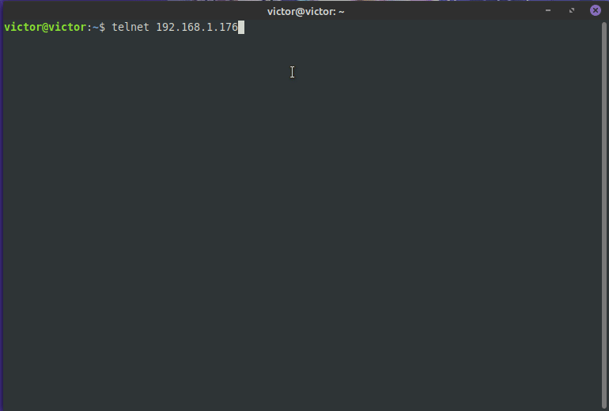
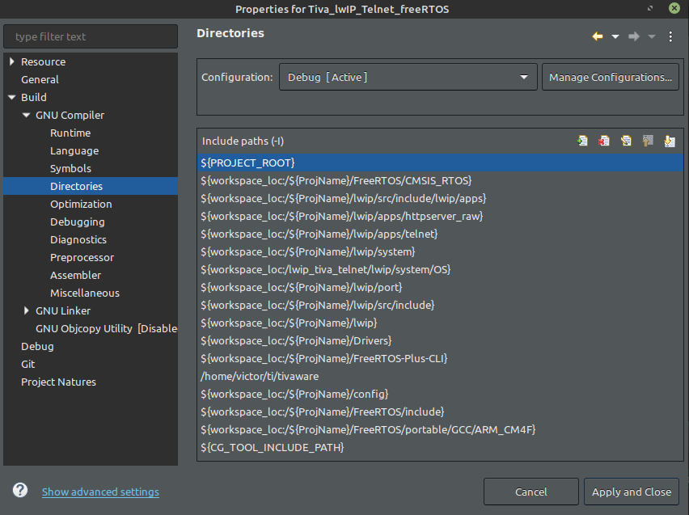
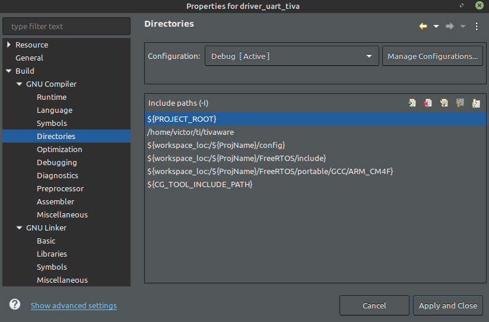
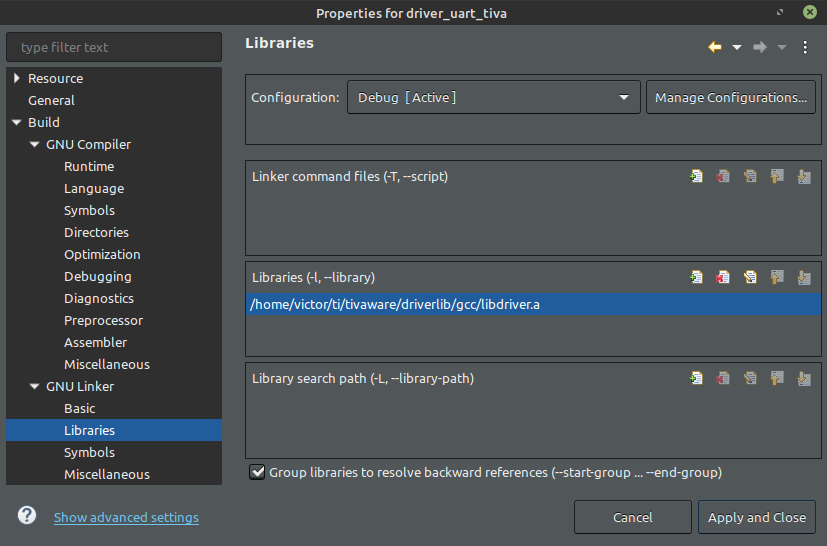
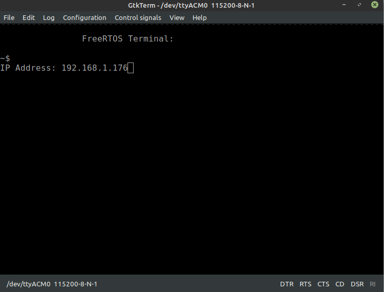
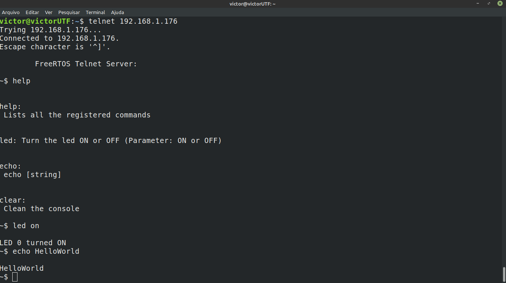
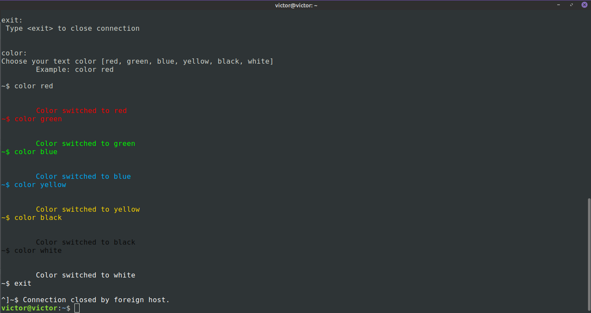

# Telnet_lwIP_Tiva_freeRTOS
Telnet Server project based on lwIP and freeRTOS+CLI for Tiva Connected TM4C1294XL.

## Screenshots




## Requirements

The project was developed on **Code Composer Studio Version: 10.1.0.00010**

The CCS Project was created and configurated exactly like the images below:



Change here **/home/victor/ti/tivaware** to your **tivaware** path


Also here...



That's all !

## How to use
Run the commmand:

```bash
victor@victorUTF:~$ dmesg | grep tty
  [    0.090095] printk: console [tty0] enabled
  [ 1950.239035] cdc_acm 1-1:1.0: ttyACM0: USB ACM device
  [32232.341969] cdc_acm 1-1:1.0: ttyACM0: USB ACM device
```
Connect in **dev/ttyACM0** serial port, using **GtkTerm**, **PuTTy** or similars, and set port to **115200 8-N-1**.

Check the **IP Address** on the serial port to find out which IP to connect.


And finally, connect to the telnet server.



